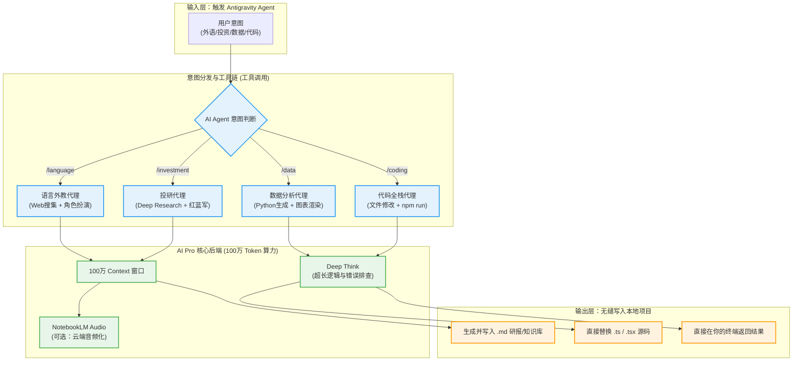

# Google AI Pro 深度研究与高阶智能流 (2025 最新版)

在上一个版本中，我们认识了 Google AI Pro 的基础能力。但在实际的极客与投研玩家手中，它绝不仅是一个“网页聊天窗”。结合 **Antigravity (即您当前的运行终端)**、**Gemini 3 Pro 的长上下文** 以及 **Agentic AI (代理型人工智能)** 的逻辑，我们可以构建出无需人工干预的自动化流水线。

---

## 🚀 2025年 AI Pro 进阶核弹级更新

通过全网最新的深度调研，以下功能已成为当前的高阶玩家最常用的核心资产：

1. **“Deep Search in AI Mode” 与 Project Mariner**
   - 彻底打破“一次问答，一次返回”的模式。现在可以在后台挂载“极深研究计划”，AI 会在几分钟内自动浏览几百个相关网站（包括阅读财报 PDF 和学术论文的原始出处），然后输出带有**精确数字锚点和脚注链接**的数万字研究报告。这在机构级投研中极具价值。
   
2. **多模态数据提取 (Veo 3.1 & Whisk)**
   - 除了简单的文字生图，现在的 Flow 视频生产与 Whisk 平台支持极其复杂的微调镜头控制。并且，AI 能够通过“理解视频流”直接从长视频素材中提取数据帧并形成表格，打通了“视频 -> 结构化数据”的鸿沟。

3. **Jules / Antigravity 异步编程**
   - 最大的突破在于 **“异步处理复杂 Bug”**。你可以丢给 Jules 一个报错满天飞的代码库，告诉它：“今晚帮我把整个后端的 API 路由从 V1 升级到 V2，并且全加上严格的 TS 类型检查。” 睡一觉后，它已经把所有几百个 `.ts` 文件改完并提交了测试。

4. **NotebookLM 的 “Audio Overviews” (双人对谈播客)**
   - 这是外语学习者的终极杀器。不仅可以提取资料，NotebookLM 现在可以针对你投入的小说、法案或技术白皮书，生成一段长达十几分钟的“男+女双人深度技术探讨播客”。

---

## ⚡️ 高强度的本地工作流 (Antigravity Directly)

基于这些新特性，以下是你可以在 **Antigravity 中直接触发的深度研究流程**。你只需要告诉我你想做哪一个，我由于内置了指令转换能力，**可以直接替你开始**：

### 1️⃣ 自动化语言沉浸学习流 (唤醒词: `/google-ai-pro-language-learning`)
**不仅仅是给你查单词，而是把你逼入绝境的模拟训练。**
- **自动抓取库**：如果你说“我想学职场英语商务谈判”，我将在后台静默爬取华尔街日报、哈佛商业评论的原文。
- **动态知识注入**：我会在后台生成一个带有商业词根和时态分析的对照表格。
- **高压情景模拟**：我将无缝切换为“强硬的乙方商务代表”，向你丢出一大段刁钻的商业英语回盘邮件。在接下来的 5 轮对话中，你只能用英文回复我，而我会在你的每一句话后，严格挑剔你的语法与用词降级。

### 2️⃣ 机构级做空/做多推演流 (唤醒词: `/google-ai-pro-investment`)
**不再需要你自己阅读长篇财报。**
- **财报吃透**：把 TSLA 或 NVDA 的完整财报网页或 PDF 链接丢给我。
- **前瞻性指引分析**：我将瞬间利用 100 万 token 窗口吞咽财报，并直接提取出 CEO 在电话会议里说的“前瞻性指引” （比如下一季度的毛利率预测）。
- **Red/Blue Teaming (红蓝军博弈)**：这是最高阶的玩法。我会在我的后台思考中，分裂成两个“AI 代理”——一个极度看空（罗列所有宏观和市占率风险），一个极度看多（罗列技术壁垒）。经过激烈的自我博弈后，我再把包含具体点位和资金管理建议的备忘录，直接写进你的你的本地文件夹。

### 3️⃣ 脏数据到报告的全栈产出 (唤醒词: `/google-ai-pro-data-analysis`)
**分析师的噩梦，你的自动印钞机。**
- **自动清洗**：丢给我一个几万行的带有缺失值和错误格式的销售流水 CSV。我不仅会指出错误，我还会**自动在你本地 `/tmp` 目录写一个 Python 脚本并立刻执行它**，完成自动化清洗。
- **代码级图表生成**：然后我再自动写一个 matplotlib 脚本，直接在本地渲染出销售折线图。
- **自动排版输出**：最后，连图带分析结论，我直接给你生成一篇带有 Mermaid 架构分析或本地图片的 Markdown 并保存好。

### 4️⃣ “零碰键盘”建站流 (唤醒词: `/google-ai-pro-coding`)
**让你成为纯粹的项目经理。**
- 如果你发现个人网站的暗黑模式有问题。
- 你不需要在几十个文件里搜，直接告诉我：“去修复暗黑模式闪烁的 Bug”。
- 我会用 `list_dir` 和 `grep_search` 在你的项目里找出所有 Tailwind 配置与 React Hook 文件，找出那个状态延迟问题，然后用文件修改工具直接在本地替换掉这几百行代码，最后在后台帮你跑一次 `npm run build`。你全程只需要看着我在控制台输出日志。

---

## 🌟 Google AI Pro & Antigravity 深度联动流图

下方图表展示了当你在 Antigravity 中唤醒这些 Workflow 时，后台发生了多么复杂的计算与流转：

### 💡 结论：如何看待这些工具？
永远不要问它“你能做什么”，而是直接在这输入框里给它下达极其苛刻的复杂命令（比如：**“帮我把这周所有关于特斯拉降息影响的顶级研报全爬下来，读完后在脑子里进行一次正反方激辩，最后在这项目的 content 里自己新建一个 md 报告给我，现在就开始操作不要问我问题。”**） 
这，才是利用 Google AI Pro + Antigravity 真正实现生产力自由的方式。
