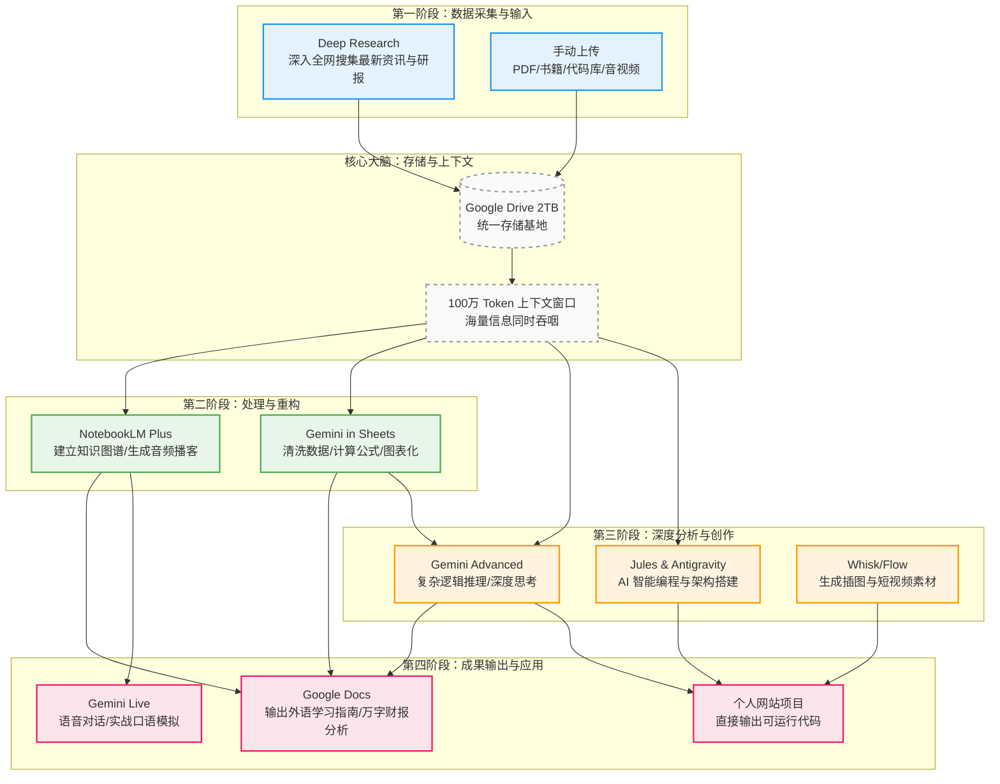

# Google One AI Pro 全能使用指南与实战工作流

Google One AI Premium 在近期已全面升级为 **Google AI Pro**（以及更高级的 Ultra 版），引入了一系列极其强大的新功能和更高的使用限额。这不仅仅是一个对话机器人，而是一个**深入到你所有数字生活中的超级大脑**。

---

## 🚀 核心功能盘点 (2024-2025 全新升级)

1. **Gemini Advanced (1.5 Pro / 2.0 / 3.0 前瞻)**: 
   - 拥有 **100万 Token 超大上下文窗口**（可一次性塞入1500页文档或3万行代码）。
   - 具备甚至超越人类复杂推理能力的 Deep Think（深度思考）模式。
2. **Workspace 深度整合 (Google 全家桶)**: 
   - 无缝接入 Gmail、Docs (文档)、Sheets (表格)、Slides (幻灯片)、Drive (云端硬盘)。AI 可以直接读取你的邮件、撰写文档、分析表格数据。
3. **NotebookLM Plus**: 
   - 个人的 AI 知识库与研究助手。可以将庞杂的各种文档、书籍直接喂给它，它不仅能生成智能大纲、Q&A，还能为你生成**双人对谈的播客级音频 (Audio Overviews)**。
4. **Deep Research (深度研究)**: 
   - 只需要给一个主题，它会自动在全网浏览数百个网页，交叉验证信息，最后生成包含权威引用的万字研究报告。
5. **顶级代码与开发工具**: 
   - **Jules & Google Antigravity**: 专门的 AI 智能编程代理，能理解整个代码库，自主排查 Bug、编写测试，甚至直接搭建网站的基础架构。
6. **创意与多媒体工具 (Flow & Whisk)**: 
   - 借助 Veo 视频模型和图像模型，你可以直接通过文字生成高质量的短视频、动画和图像，每月提供 1000 AI 积分。
7. **2TB 超大云端存储**: 满足你存放海量数据集、视频素材和个人文件的需求。

---

## 🧠 交叉发散思维：四大核心实战场景

只要将上述功能**组合使用**，就能产生1+1>2的化学反应。以下是打破常规视角的发散应用方案：

### 🎬 场景一：利用 AI 打造沉浸式外语学习环境 (英语/西班牙语)
不要把 AI 当作翻译词典，要把它当成你的**专属外教团队**。
*   **输入流 (Deep Research + Drive)**: 利用深度研究功能，自动搜集海量西班牙语的原汁原味新闻、文化背景、播客文稿，一键存入 Google Drive。
*   **知识库化 (NotebookLM)**: 将 Drive 中的几百页西语语法书、西语原著 PDF 导入 NotebookLM。
*   **强化听力与口语 (NotebookLM Audio + Gemini Voice)**:
    *   **听力**：让 NotebookLM 根据这本西语原著，生成一段“探讨书中拉美文化”的双人深度访谈播客（Audio Overview），你在通勤时当电台听。
    *   **口语**：打开手机上的 Gemini Live 语音模式，告诉它：“我是一个去马德里旅游的游客，你扮演房东，我们用西语模拟一次入住交接，如果我犯了语法错误，请立刻中文纠正我。”
*   **词汇管理 (Docs + Sheets)**: 在 Google Docs 中阅读文章时，遇到生词，让 Gemini 侧边栏自动提取生词本，并一键导入 Google Sheets。然后在 Sheets 里让 AI 自动按记忆曲线排期、造句。

### 💻 场景二：零基础/进阶学习计算机知识与建设个人网站
拥有 100 万 Token，意味着你可以把**整个框架官方文档**塞给 AI。
*   **架构设计 (Deep Research + Docs)**: 让 Deep Research 搜索“2025年最流行的全栈博客框架 (如 Next.js + Tailwind) 及 SEO 最佳实践”，并在 Docs 中生成一份详细的建站企划书。
*   **沉浸式编程 (Jules + Antigravity)**:
    *   不再是一段段复制粘贴代码。将整个你喜欢的开源博客 GitHub 库打包发给 **Jules** 或利用大上下文喂给 Gemini Advanced。
    *   告诉它：“理解这套代码的设计模式，现在帮我在 `personal-website` 项目中，新增一个基于 Markdown 的动态路由页面。” AI 能直接跨文件进行逻辑修改。
*   **素材自动生成 (Whisk & Flow)**: 个人网站缺乏配图？直接用 Whisk 生成高质量的扁平化/3D插图，或者用 Flow 生成一段网页背景的无缝循环视频。

### 📊 场景三：海量数据分析自动化
适合处理工作中的报表、市场调研数据。
*   **数据清洗 (Sheets + Gemini)**: 将公司一整年的杂乱销售数据 CSV 导入 Google Sheets。直接在侧边栏唤醒 Gemini："清理表格中的空值，统一日期格式，并提取出第四季度的所有异常订单。"
*   **宏观洞察 (NotebookLM)**: 将清理后的图表、过去的几十份市场调研 PDF、竞争对手的年报全部堆进 NotebookLM。
*   **报告输出 (Slides/Docs)**: "根据 NotebookLM 提取的趋势（如：竞品在下半年销量的下滑原因），在 Google Slides 中帮我生成一版重点汇报 PPT 框架，并代写每一页的演讲稿 (Help me write)。"

### 📈 场景四：散户也能用的机构级投资分析
建立一套自动化的个人投研工作流。
*   **情报收集 (Deep Research)**: 输入指令：“帮我深度调研特斯拉 (TSLA) 在自动驾驶 (FSD) 领域的最新进展、全球电动车销量预期以及美国宏观降息政策对它的影响，输出包含数据来源的万字研报。”
*   **财报解构 (100万 Token 解析)**: 每当公司发布动辄几百页的 10-K（年报）、财报电话会议录音转录文稿，你都不需要自己读。全选扔进 Gemini Advanced：“用两句话总结 CEO 对未来毛利率的指引，并列出华尔街分析师在 Q&A 环节最关心的三个风险点。”
*   **量价与基本面结合 (Sheets + Gemini)**: 
    *   在网页版 Google Finance 抓取历史股价走势，或者导入交易流水到 Sheets。
    *   让 Gemini 用公式帮你算最大回撤、夏普比率。结合之前的**基本面研报**，让 AI 扮演"悲观的做空者"和"乐观的做多者"进行辩论，帮你进行更理性的资产配置决策。

---

## 🌟 Google AI Pro 工具链协同工作流 (可视化)

下方图表展示了如何将各种孤立的功能串联成自动化的信息处理流水线：

### 🎯 总结建议
不要把 Google AI Pro 当成一个“问答机器”，而应该把它当作一个**由多名专家组成的虚拟团队**：
1. **研究员** 负责 Deep Research
2. **资料管理员** 负责 NotebookLM
3. **数据分析师** 负责 Sheets
4. **程序员** 负责 Jules/Antigravity
5. 你自己，则是这个团队的 **CEO (发号施令者和最终决策者)**，利用它们无缝串联起从学习、编码、数据到投资的每一个生活细节。
