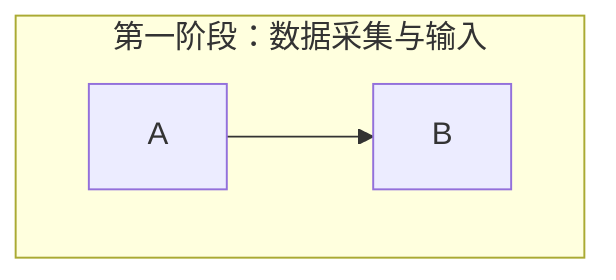
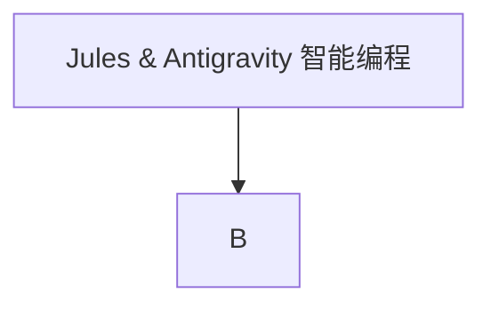

# Mermaid 图表语法与渲染防坑指南

在使用 `react-markdown` 配合正式版 `mermaid` 库在前端渲染图表时，经常会遇到 **“图表无法出现”** 或在控制台报错 `Error: Lexical error on line X. Unrecognized text.` 的情况。

为了防止以后踩坑，特此记录最常见的两类语法错误。

## 1. 包含特殊字符和全角中文符号的 `subgraph`
如果你的子图（`subgraph`）或者节点的名称中包含了全角标点符号（如中文的冒号 `：`）或包含空格的复杂句子，如果不加任何处理，解析器会将其识别为非法字符导致全图崩溃。

**❌ 错误写法（会报错）：**
```mermaid
graph TD
    subgraph 第一阶段：数据采集与输入
        A --> B
    end
```

**✅ 正确写法（加上双引号）：**


## 2. 节点名称中包含系统保留字符（例如 `&`）
在 Mermaid 中，符号 `&` 常被用作组合语法的连接符（例如 `A & B --> C`）。如果你想在一个普通的节点名字里展示这个符号，直接写不仅会排版错乱，还会报语法错误。

**❌ 错误写法（解析错乱）：**
```text
graph TD
    A[Jules & Antigravity 智能编程] --> B
```

**✅ 正确写法（加上双引号）：**


## 总结
**黄金法则**：在使用 Mermaid 编写含有大量**中文长句**、**全角符号**、或者 **特殊保留符号 (`&`, `(`, `)`, `{`, `}`)** 的图表时，请务必养成给所有 `subgraph` 的标题以及节点的中括号 `[]` 内部文本，**严格加上英文双引号 `""`** 的习惯。

> 提示：在 Antigravity 的自动化工作流中生成包含图表的报告时，也可以在提示词中直接告知 AI：“绘制 mermaid 图表时，请务必给中文标题和含有特殊符号的节点加上双引号，防止解析失败。”
